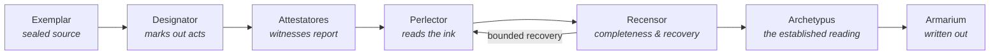
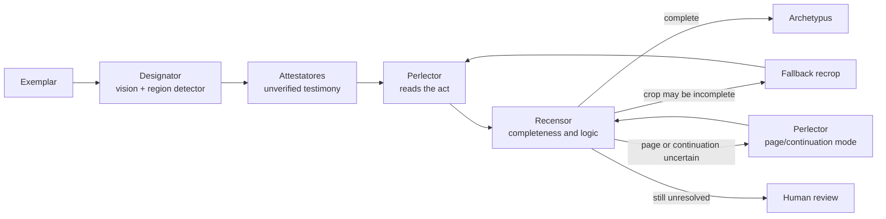

# Architecture — Apparatus Verbatus

*Architectural direction. Implementation is discovered and tested during alpha, not
settled here.*

## The claim

> The **Attestatores** report what they saw.
> The **Perlector** considers their testimony but establishes its finding from the
> **Exemplar** itself.

An Attestator sees the image too — that is not what makes its output secondary. Its
*role* is to report what it perceived. The Perlector's role is to establish a finding by
examining the evidence directly while treating every Testimonium as fallible.

The courtroom holds the shape of it. A weak witness is a bystander describing what they
saw. A stronger one is a trained officer — usually better, never automatically right.
The Perlector is the fact-finder: it hears every account, examines the evidence itself,
understands what each witness was positioned to see, and establishes a finding grounded
in the ink.

*Testimonium* is report. *Autopsia* is sight of the thing itself. Both may look at the
page; only one establishes the text.

## The flow

**Stage names describe responsibilities, not models.** One model may serve more than one
role — the detector that finds act regions also reads them, and a secondary detector
proposes regions too. Which model fills which role is configuration, not architecture.

## The stages

**Exemplar** — the sealed source. In manuscript practice the exemplar is the original
you copy *from*; here it is the immutable scanned page, hashed and accounted for.
Nothing downstream may alter it.

**Designator** — *designo*, to mark out. Finds the acts on the page and marks their
bounds.

It **may use textual as well as visual cues.** Act boundaries in parish registers are
frequently signalled textually — marginal names, the formulaic *L'an mil sept cent…*
opening — and purely visual segmentation would run acts together wherever the scribe
left no gap. Its restriction is not that it never reads. Its restriction is that **it
never establishes the authoritative transcription.**

**Attestatores** — the witnesses. Each reads the marked regions and produces a
**Testimonium**: **unverified, of uncertain and unequal quality, and never final.**
Always retained; never authoritative. Referred to in code by numbered role, with model
and revision bound in one pinned config; the Testimonium itself carries the resolved
identity that produced it.

**Perlector** — *perlegere*, to read through to the end. Reads the ink itself, using the
testimonia as clues that sharpen its own reading, never as options to choose between.
Where it produces several readings, it reconciles them **itself, against the image** —
and that reconciliation is bound by "never picks" like any other step. It reads through
to the end; truncation is a failure, not an output.

**Recensor** — *recensio*. The completeness and recovery stage. See below.

**Archetypus** — the established reading. In textual criticism, the ancestor from which
all surviving witnesses descend. This is the authoritative *pipeline output* — a machine
reading, not truth.

**Armarium** — the cupboard where finished codices were kept, as against the scriptorium
where they were made. Where the pipeline writes its output: the established text, its
provenance, and the link back to the ink, in whatever formats are asked for. The
pipeline ends here.

## The Recensor

It reviews and establishes that the text is **complete**. It establishes no text and it
censors nothing.

It examines the page, the act crops, the testimonia, and the Perlector's findings, and
asks whether:

- an act or meaningful region was missed
- a crop is cut off, or part of an act lies outside it
- an act continues onto the next page
- coverage, act order, or geometry fails to reconcile

It may then accept the result, request a fallback or expanded recrop, send a new crop
back through the Perlector, request a full-page or continuation-aware pass, link
material across pages, or hold for review.

**It recovers coverage, not quality.** A suspected fabrication or a poor reading may be
flagged for review. It may never be re-rolled until it looks better.

**Recovery is bounded.** The loop runs to a finite, configured budget before handing to
review, so the system cannot reconsider itself indefinitely. Every loop is recorded, and
nothing may disappear inside one. The starting proposal is one fallback recrop and one
page-level reread; the actual budget is established through alpha testing.

Roughly, with the branches drawn out:

**Implementation is deliberately undecided.** Candidates, to be tested in alpha:
deterministic checks on coverage, geometry, numbering, dates, abrupt endings and page
order; a vision model or the Perlector in full-page mode; a separately tuned Perlector
if testing shows it is needed; a small text-only model that flags gaps or incoherence;
review where uncertainty remains.

A text-only model may **flag** a problem. It may never rewrite or establish text.

## The objects

| Object | What it is |
|---|---|
| **Testimonium** | One witness's report. Unverified. Carries the model identity and revision that produced it. |
| **Lectio** | One reading pass by the Perlector, primed or unprimed. |
| **Lectio nuda** | An unprimed Lectio. No witness shown. The baseline. |
| **Perlectio** | What the Perlector returns: the reading, what it was based on, and its dissent. |
| **Archetypus** | The established reading. Pipeline output, not truth. |

### On dissent

The Perlectio records where the reading departed from every witness. This is
**structural, not evaluative**: it makes parroting measurable without new
instrumentation.

It is not a quality signal on its own. Most lines in a parish register are easy and
every witness agrees; zero dissent there is the correct output. A metric that rewards
disagreement rewards hallucination.

## Invariants

High-level and binding. Detailed schemas and interface contracts belong in a
`DATA_CONTRACT.md` once alpha has taught us what they are.

1. Act identity survives recropping.
2. Every candidate and recovery region traces back to the Exemplar.
3. The exact image shown to a model is reproducible from the Exemplar plus the recorded
   transforms.
4. Nothing disappears inside a recovery loop.
5. Recovery loops are bounded and recorded.
6. Partial or unresolved results can never appear complete.
7. Pipeline output is a machine reading, not truth.
8. Every proposed region ends as accepted text, an explicit exclusion, or a review item.
