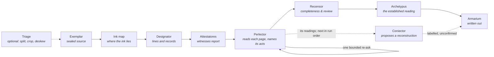
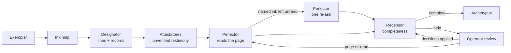

# Architecture

*The shape of the pipeline and the reasons for it. Each stage's records and interface are
in its `CONTRACT.md`; [pipeline/README.md](pipeline/README.md) maps the directories.
Terms are defined in [GLOSSARY.md](GLOSSARY.md); the principles they serve are in
[PRINCIPLES.md](PRINCIPLES.md).*

## The claim

> The **Attestatores** report what they saw.
> The **Perlector** considers their testimony but establishes its finding from the
> **Exemplar** itself.

An Attestator sees the image too — that is not what makes its output secondary. Its
*role* is to report what it perceived. The Perlector's role is to establish a finding by
examining the evidence directly while treating every Testimonium as fallible.

The courtroom holds the shape of it. A weak witness is a bystander describing what they
saw. A stronger one is a trained officer — usually better, never automatically right.
The Perlector is the fact-finder: it hears every account, examines the evidence itself,
understands what each witness was positioned to see, and establishes a finding grounded
in the ink.

*Testimonium* is report. *Autopsia* is sight of the thing itself. Both may look at the
page; only one establishes the text.

## The flow

```mermaid
flowchart LR
    T["Triage<br/><i>optional: split, crop, deskew</i>"] -.-> A
    A["Exemplar<br/><i>sealed source</i>"] --> I["Ink map<br/><i>where the ink lies</i>"]
    I --> B["Designator<br/><i>lines and records</i>"]
    B --> C["Attestatores<br/><i>witnesses report</i>"]
    C --> D["Perlector<br/><i>reads each page, names its acts</i>"]
    D -->|"one bounded re-ask"| D
    D --> E["Recensor<br/><i>completeness & review</i>"]
    E --> F["Archetypus<br/><i>the established reading</i>"]
    F --> G["Armarium<br/><i>written out</i>"]
    D -.->|"its readings; next in run order"| K["Coniector<br/><i>proposes a reconstruction</i>"]
    K -.->|"labelled, unconfirmed"| G
```

The run order is Exemplar, Ink map, Designator, Attestatores, Perlector, Coniector,
Recensor, Archetypus, Armarium. Each is a separate program that reads sealed records
and refuses to start until its predecessor's stage seal verifies. The Coniector is a
side branch: it reads only the Perlector's readings and requires only the Perlector's
seal. Recensor and Archetypus do not read it; Armarium verifies its seal and reads
what it writes. A hold at Recensor therefore leaves Coniector complete before the
run stops.

**Stage names describe responsibilities, not models.** One model may serve more than one
role; which model fills which role is configuration, not architecture.

## The stages

**Triage** — optional work before the door, and not a stage of a run: deciding how each
photographed frame is split into pages, cropped, deskewed and converted, and which
frames are captures of the same leaf. Its tools (`operations/triage/`, with pagekit
preparing the pages) write decision documents that the door applies; it never chooses
among captures. Its contract is `pipeline/0_triage/CONTRACT.md`.

**Exemplar** — the sealed source. In manuscript practice the exemplar is the original
you copy *from*; here it is the immutable scanned page, hashed and accounted for.
Nothing downstream may alter it. Before it, the door checks each submitted file,
renders or splits it into pages, and records anything it refuses.

**Ink map** — measures where ink lies on each sealed page, with no model involved. It
gives the page accounting and the Armarium an independent account of the page: an
inked region that no reading region claims is a candidate for a missed act.

**Designator** — *designo*, to mark out. Publishes the page evidence the reading is
checked against: the lines and blocks a layout detector (Surya) finds, and the records
a record detector finds, with their crops. It marks out no act and establishes no text,
but the page accounting holds a page when the reading and the detector's records
disagree.

Act boundaries in parish registers are often signalled textually — marginal names, the
formulaic *L'an mil sept cent…* opening — and purely visual segmentation would run acts
together wherever the scribe left no gap. So the acts are named by the reader that reads
the whole page, and the detectors' records are independent evidence that the accounting
checks each act against.

**Attestatores** — the witnesses. Every witness reads every sealed page: a whole-page
reader reads the page image, and a record reader reads the crops of the records its
detector found on the page. Each produces one **Testimonium** per page:
**unverified, of uncertain and unequal quality, and never final.** Always retained;
never authoritative. Each witness sits in a chair, with model and revision pinned in the
model roster; the Testimonium carries the resolved identity that produced it.

**Perlector** — *perlegere*, to read through to the end. Reads each sealed page whole,
in one call, names the acts on it, and establishes their text from the ink, using the
testimonia as clues that sharpen its own reading, never as options to choose between.
What the call is shown is the page's feed: the page image, each witness's page broken
into its own units, and the detected lines and blocks, each with an id. The Perlector
does not reason from context: a date that looks wrong beside its neighbours is written as
the ink shows it. Each entry it names cites the ids it read, and its region is the
boxes of the witness units and lines it cites; a block lends no area. Every witness unit
must be cited or set aside with a reason; every detected line and detector record must
lie inside some entry's region (a line may also be set aside). It reads
through to the end; truncation is a failure, not an output. A run configured to show no
page image cannot establish text from the ink, and every act it reads is held.

Every page reading is then measured by the **page accounting**, a model-free check that
every witness unit, detected line, detector record, witness's text and the page's ink
is accounted for. Anything it cannot account for, or cannot measure, holds the page.

**A page that cannot be read is not an empty page.** The cases are kept apart:

- a page the door could not decode (corrupt or unreadable) is refused: it is recorded
  but never counted as acts, and it counts toward the run's hard-failure cap;
- a page whose reading call failed is held as unread, and counts toward the cap;
- a page whose answer is not a parsed, valid answer is held as unread;
- a page the Perlector reads as having no text is only a claim, held until checked;
- a page is *blank* only when the Recensor confirms that claim: the page accounting
  finds no ink left unread, the record detector found no record, no line was detected,
  at least one witness read the page, and every witness that read it found no text.

Ink with no reading is held for a person, never passed as blank.

Where the first reading leaves named ink unread — a witness unit neither cited nor set
aside, or a detected line or detector record outside every region — the Perlector may be
asked once more about exactly those ids: **one bounded re-ask**, additive, separately
recorded, and never a replacement for the first reading. Acts it recovers are labelled
"read on re-ask".

**The Perlector chair is swappable, and that is a design requirement rather than a
convenience.** A stock base model, an unaltered vendor model, and a locally trained checkpoint
must all be able to sit in it behind the same interface, with the resolved identity of whichever
one ran bound into every Perlectio. A locally trained checkpoint is *called* like any other model,
from its own model repository, and is never vendored into the pipeline it serves. Trained weights
are a *candidate*, never a privileged inheritance: a checkpoint trained on some earlier pipeline's
output may have learned to agree with witnesses rather than to read ink, and that is not visible by
inspection. It is visible only to an instrument that takes the witnesses away — a blind
baseline, run as an experiment beside the pipeline — and in the dissent record. A candidate
whose advantage disappears once the witnesses are taken away has not learned to read,
whatever its transcription score says.

**Recensor** — *recensio*. The completeness stage. See below.

**Archetypus** — the established reading. In textual criticism, the ancestor from which
all surviving witnesses descend. It establishes each reading the Recensor accepted, and
only those. This is the authoritative *pipeline output* — a machine reading, not truth.

**Coniector** — one who conjectures; in textual criticism a conjecture is a reading no
witness carries, proposed from sense and context. The Coniector reads the Perlector's
transcriptions as text, never the page image, and looks for what does not fit: an act
cut at a page break, half an act, a date out of sequence such as 1888 among acts of
1666. It proposes a reconstruction under the diplomatic, recording each departure with
its span and both readings. A person may make one too; every reconstruction is labelled
by who made it. It joins pieces across a page break only when the run declares its pages
consecutive. A reconstruction is never established and never counted. Whether the
Coniector runs is a sealed switch.

**Armarium** — the cupboard where finished codices were kept, as against the scriptorium
where they were made. Where the pipeline writes its output: the established text, its
provenance, any reconstruction labelled beneath it, and the link back to the ink, in
whatever formats are asked for. The pipeline ends here.

## The Recensor

It establishes that the reading is **complete**. It establishes no text, censors
nothing, calls no model and asks for no recovery; every check it makes is deterministic.

It reviews every unit the run counts — each entry of a page's reading, or the one row
standing for a page that has none — and asks whether:

- the page accounting accounted for everything on the page (its verdict is recomputed
  from the sealed records, not taken from the Perlector);
- the witness floor is met: enough of the configured witnesses read the page and were
  not truncated;
- ink on the page lies outside every reading region (the page's own pixels, measured
  against every box of every region);
- a page claimed blank, or holding only entries that are not acts, really is so;
- an act continues onto the next page: at each page break, the last act of one page and
  the first of the next are compared by their continuation flags, and a claim only one
  side makes is held.

A unit is accepted only when nothing holds it. Otherwise it is held for review with
every reason named. The Recensor may confirm a page blank or confirm that it holds no
act, and it links material across a page break when both sides agree.

A check the lead has judged not yet calibrated for the corpus is a **review flag**
rather than a hold (`[flags]` in `config/page_accounting.toml`): measured and recorded
like a hold, reported per page and per unit, carried with the reading's text in the
Armarium's flagged export beside the strict established export, but holding nothing.
Taking a code out of that list makes it hold again.

**It recovers coverage, not quality.** A suspected fabrication or a poor reading may be
flagged for review. It may never be re-rolled until it looks better. A witness model's
own pinned retry recipe belongs to that witness and gives the Recensor no extra recovery.

**Recovery is bounded.** The only recovery the system makes on its own is the page
re-ask, sealed per run in `config/recovery.toml` (one per page), before anything goes to
review, so the system cannot reconsider itself indefinitely. A person may send a held
page through the Perlector again: that operator re-read is the person's act, bound to
their decision, outside the budget and never re-asked by the machine, and it becomes the
page's current reading. Every attempt is recorded, earlier readings stay marked
superseded, and nothing may disappear inside one.

**Operator review.** A run whose Recensor holds anything stops there, before anything
is established or exported, in every mode and on the pod. A person then decides each
held unit or page with `verbatus decide`. Each decision binds to the review it was made
against and goes stale when that review changes; the run resumes from the Recensor,
which applies the current decisions, or from the Perlector after a page `re-ask`. The
decisions are:

| Decision | About | Effect |
|---|---|---|
| `release` (override) | a unit | clears the unit's own holds; with nothing else holding it, the model's reading goes to export exactly as read, labelled "released by operator" with who, when, why and the holds it cleared. Refused when the unit has no hold of its own, and when the reading has no place on the page, malformed doubt marks or no text |
| `edit` (correction) | a held unit | a person's corrected text becomes the reading, taken as the truth with no machine doubt, labelled "corrected by a person" with who, when, why and an optional note, with the model's reading beside it as "model reading (original)". Refused for a reading with no place on the page |
| `exclude` (exclusion) | a unit | keeps the unit out of the delivered text but in the record, citing the decision |
| `hold` | a unit or page | keeps it held, naming a finding |
| `re-ask` | a page | asks for an operator re-read: the page stays held until the run resumes from the Perlector, which reads it again |
| `re-ask` | a unit | holds the unit (`review-reask`) and records the request; nothing is read again until a person records a `re-ask` of its page |
| `no-missed-act` | a page | clears the page's holds; a reading it releases is labelled "released by operator". Refused on a page that was never read |
| `missed-act` | a page | holds the page as missing an act |
| `re-shoot` | a page | holds the page and records a request for a new capture |

The operator's `re-ask` is a person's request for an operator re-read; it is not the
machine's bounded re-ask.

Unit decisions apply only to entries of a reading; a row standing for a whole page takes
page decisions. A held one-sided page break is not a unit or a page and cannot be
decided: a person passes it with `verbatus advance`, and the export names it.

A reading with no place on the page, malformed doubt marks or no text cannot be
overridden, because the export could not carry it. A correction may replace malformed
doubt marks or missing text, since the person's text is what is delivered, but a
reading with no place on the page stays held. When more than a sealed share of a run's
pages are held (1 in 50 in `config/review.toml`), the run has a systemic problem, not a
few hard pages. It stops as any hold does and says so, and a person who advances it
anyway carries that warning into the export and the notification.

Roughly, with the branches drawn out:

```mermaid
flowchart LR
    E["Exemplar"] --> M["Ink map"]
    M --> D["Designator<br/>lines + records"]
    D --> A["Attestatores<br/>unverified testimony"]
    A --> P["Perlector<br/>reads the page"]
    P -->|"named ink left unread"| Q["Perlector<br/>one re-ask"]
    Q --> R
    P --> R["Recensor<br/>completeness"]

    R -->|"complete"| AR["Archetypus"]
    R -->|"held"| H["Operator review"]
    H -->|"decisions applied"| R
    H -->|"page re-read"| P
```

No model but the Perlector establishes text or changes a reading. The Coniector's
reconstruction is the one text a model proposes from context, and it stays a labelled
layer beside the reading.

## Dissent

The Perlectio records where the reading departed from every witness. This is
**structural, not evaluative**: it makes parroting measurable without new
instrumentation.

It is not a quality signal on its own. Most lines in a parish register are easy and
every witness agrees; zero dissent there is the correct output. A metric that rewards
disagreement rewards hallucination.

## Invariants

High-level and binding. Detailed schemas and interface contracts are in each stage's
`CONTRACT.md`.

1. An act's identity is bound to its page and region; a later reading of a page is a new
   attempt, never an edit.
2. Every reading region traces back to the Exemplar.
3. The exact image shown to a model is reproducible from the Exemplar plus the recorded
   transforms.
4. Nothing disappears inside a re-ask.
5. Re-asks are bounded and recorded.
6. Partial or unresolved results can never appear complete.
7. Pipeline output is a machine reading, not truth.
8. Every page and every act the reading names ends as accepted text, a confirmed blank
   or no-act page, or a review item. A page that cannot be read is a failure, never zero
   acts.
9. A witness's reading is never itself an output. Showing testimony as testimony is not
   a second text.
10. No code repairs, rewrites or re-rolls what a model returned, with one exception:
    a page answer whose only fault is bare JSON keys is parsed with those keys quoted,
    the repair recorded and the reply's bytes kept as sent
    (`pipeline/4_perlector/CONTRACT.md`). Each model is asked properly — complete
    input, in its documented format, with a way to mark what it cannot read — and its
    answer is recorded as given and flagged if it looks wrong.
11. Every stored reading carries the identity and revision of the model that produced
    it, the image region it read and the transforms applied to that image.
    Configuration protects future runs; the record protects the past.
12. Every re-ask attempt is kept, including each attempt of a model's own pinned retry
    recipe.
13. A reconstruction never replaces, changes or counts as a reading; it is shown only
    beside the diplomatic it departs from, labelled with who made it.
