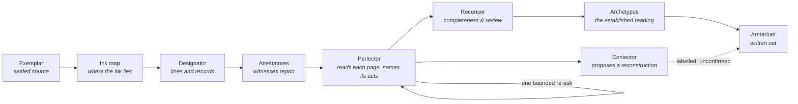
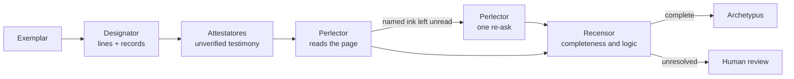

# Architecture

*The shape of the pipeline and the reasons for it. Implementation details are discovered
and tested during alpha; they are not settled here. Terms are defined in
[GLOSSARY.md](GLOSSARY.md); the principles they serve are in [PRINCIPLES.md](PRINCIPLES.md).*

## The claim

> The **Attestatores** report what they saw.
> The **Perlector** considers their testimony but establishes its finding from the
> **Exemplar** itself.

An Attestator sees the image too — that is not what makes its output secondary. Its
*role* is to report what it perceived. The Perlector's role is to establish a finding by
examining the evidence directly while treating every Testimonium as fallible.

The courtroom holds the shape of it. A weak witness is a bystander describing what they
saw. A stronger one is a trained officer — usually better, never automatically right.
The Perlector is the fact-finder: it hears every account, examines the evidence itself,
understands what each witness was positioned to see, and establishes a finding grounded
in the ink.

*Testimonium* is report. *Autopsia* is sight of the thing itself. Both may look at the
page; only one establishes the text.

## The flow

```mermaid
flowchart LR
    A["Exemplar<br/><i>sealed source</i>"] --> I["Ink map<br/><i>where the ink lies</i>"]
    I --> B["Designator<br/><i>lines and records</i>"]
    B --> C["Attestatores<br/><i>witnesses report</i>"]
    C --> D["Perlector<br/><i>reads each page, names its acts</i>"]
    D -->|"one bounded re-ask"| D
    D --> E["Recensor<br/><i>completeness & review</i>"]
    D --> K["Coniector<br/><i>proposes a reconstruction</i>"]
    E --> F["Archetypus<br/><i>the established reading</i>"]
    F --> G["Armarium<br/><i>written out</i>"]
    K -.->|"labelled, unconfirmed"| G
```

**Stage names describe responsibilities, not models.** One model may serve more than one
role; which model fills which role is configuration, not architecture.

## The stages

**Exemplar** — the sealed source. In manuscript practice the exemplar is the original
you copy *from*; here it is the immutable scanned page, hashed and accounted for.
Nothing downstream may alter it.

**Ink map** — measures where ink lies on each sealed page, with no model involved. It
gives the Recensor an independent account of the page to check coverage against: an inked
region that no reading region claims is a candidate for a missed act.

**Designator** — *designo*, to mark out. Publishes the page evidence the reading is
checked against: the lines and blocks a layout detector finds, and the records a record
detector finds, with their crops. It marks out no act and establishes no text.

Act boundaries in parish registers are often signalled textually — marginal names, the
formulaic *L'an mil sept cent…* opening — and purely visual segmentation would run acts
together wherever the scribe left no gap. So the acts are named by the reader that reads
the whole page, and the detectors' records are independent evidence that the accounting
checks each act against.

**Attestatores** — the witnesses. Each reads the page (a whole-page reader) or each
detected record on it (a record reader) and produces a
**Testimonium**: **unverified, of uncertain and unequal quality, and never final.**
Always retained; never authoritative. Referred to in code by numbered role, with model
and revision bound in one pinned config; the Testimonium itself carries the resolved
identity that produced it.

**Perlector** — *perlegere*, to read through to the end. Reads each sealed page whole,
names the acts on it, and establishes their text from the ink, using the testimonia as
clues that sharpen its own reading, never as options to choose between. It reads the
ink with the witnesses as clues and does not reason from context: a date that looks
wrong beside its neighbours is written as the ink shows it. Each act cites the lines,
records and witness units it covers, and its region is the union of those boxes. It
reads through to the end; truncation is a failure, not an output.

**A page that cannot be read is not an empty page.** Three cases are kept apart: a page
whose reading fails (it did not load, or the call failed) is a failure, held and
counted toward the run's failure cap; a page the Perlector reads as having no text is
only a claim, held until checked; and a page is *blank* only when the Recensor confirms
that claim — no ink left unread on the ink map, no line detected, and every witness that
read the page found no text. Ink with no reading is held for a person, never passed as
blank.

Where the first reading leaves named ink unread, the Perlector may be asked once more
about that page: **one bounded re-ask**, additive, separately recorded, and never a
replacement for the first reading. Acts it recovers are labelled "read on re-ask".

**The Perlector chair is swappable, and that is a design requirement rather than a
convenience.** A stock base model, an unaltered vendor model, and a locally trained checkpoint
must all be able to sit in it behind the same interface, with the resolved identity of whichever
one ran bound into every Perlectio. A locally trained checkpoint is *called* like any other model,
from its own model repository, and is never vendored into the pipeline it serves. Trained weights
are a *candidate*, never a privileged inheritance: a checkpoint trained on some earlier pipeline's
output may have learned to agree with witnesses rather than to read ink, and that is not visible by
inspection. It is visible only to an instrument that takes the witnesses away — a blind
baseline, run as an experiment beside the pipeline — and in the dissent record. A candidate
whose advantage disappears once the witnesses are taken away has not learned to read,
whatever its transcription score says.

**Coniector** — one who conjectures; in textual criticism a conjecture is a reading no
witness carries, proposed from sense and context. After the Perlector has read every
page, the Coniector reads its transcriptions as text, never the page image, and looks for
what does not fit: an act cut at a page break, half an act, a date out of sequence such
as 1888 among acts of 1666. It proposes a reconstruction under the diplomatic, recording
each departure with its span and both readings. A person may make one too; every
reconstruction is labelled by who made it. It joins pieces across a page break only when
the run declares its pages consecutive. A reconstruction is never established and never
counted, and no stage but the Armarium reads it.

**Recensor** — *recensio*. The completeness stage. See below.

**Archetypus** — the established reading. In textual criticism, the ancestor from which
all surviving witnesses descend. This is the authoritative *pipeline output* — a machine
reading, not truth.

**Armarium** — the cupboard where finished codices were kept, as against the scriptorium
where they were made. Where the pipeline writes its output: the established text, its
provenance, any reconstruction labelled beneath it, and the link back to the ink, in
whatever formats are asked for. The pipeline ends here.

## The Recensor

It reviews and establishes that the text is **complete**. It establishes no text and it
censors nothing.

It examines the page, the reading regions, the page accounting, the testimonia and the
Perlector's findings, and asks whether:

- an act or meaningful region was missed
- ink lies outside every reading region
- an act continues onto the next page
- the witness floor is met

It may then accept a unit, confirm a page blank or confirm that it holds no act, link
material across pages, or hold for review.

**It recovers coverage, not quality.** A suspected fabrication or a poor reading may be
flagged for review. It may never be re-rolled until it looks better. A witness model's
own pinned retry recipe belongs to that witness and gives the Recensor no extra recovery.

**Recovery is bounded.** The only recovery is the page re-ask, sealed per run in
`config/recovery.toml` (one per page), before anything goes to review, so the system
cannot reconsider itself indefinitely. Every attempt is recorded, and nothing may
disappear inside one.

**Operator review.** A run whose Recensor holds anything stops there, before anything
is established or exported, in every mode and on the pod. A person then decides each
held unit or page with `verbatus decide`. Each decision binds to the review it was made
against and goes stale when that review changes. The decisions are:

- an **override**, which sends the model's reading to export exactly as read, its own
  holds included, labelled "released by operator" with who, when, why and the holds it
  cleared;
- an **exclusion**, which keeps a unit out of the delivered text but in the record,
  citing the decision;
- a **request to read a page again**, which is recorded and keeps the page held.

A reading with no place on the page, unreadable doubt marks or no text cannot be
overridden, because the export could not carry it. When more than 1 in 50 of a run's
pages are held, the run has a systemic problem, not a few hard pages. It stops as any
hold does and says so, and a person who advances it anyway carries that warning into
the export and the notification.

Roughly, with the branches drawn out:

```mermaid
flowchart LR
    E["Exemplar"] --> D["Designator<br/>lines + records"]
    D --> A["Attestatores<br/>unverified testimony"]
    A --> P["Perlector<br/>reads the page"]
    P -->|"named ink left unread"| Q["Perlector<br/>one re-ask"]
    Q --> R
    P --> R["Recensor<br/>completeness and logic"]

    R -->|"complete"| AR["Archetypus"]
    R -->|"unresolved"| H["Human review"]
```

**Implementation is deliberately undecided.** Candidates, to be tested in alpha:
deterministic checks on coverage, geometry, numbering, dates, abrupt endings and page
order; a vision model; a separately tuned Perlector
if testing shows it is needed; a small text-only model that flags gaps or incoherence;
review where uncertainty remains.

A text-only model may **flag** a problem. It may never establish text or change a
reading; the Coniector's reconstruction is the one text a model proposes from context,
and it stays a labelled layer beside the reading.

## Dissent

The Perlectio records where the reading departed from every witness. This is
**structural, not evaluative**: it makes parroting measurable without new
instrumentation.

It is not a quality signal on its own. Most lines in a parish register are easy and
every witness agrees; zero dissent there is the correct output. A metric that rewards
disagreement rewards hallucination.

## Invariants

High-level and binding. Detailed schemas and interface contracts are in each stage's
`CONTRACT.md`.

1. An act's identity is bound to its page and region; a later reading of a page is a new
   attempt, never an edit.
2. Every reading region traces back to the Exemplar.
3. The exact image shown to a model is reproducible from the Exemplar plus the recorded
   transforms.
4. Nothing disappears inside a re-ask.
5. Re-asks are bounded and recorded.
6. Partial or unresolved results can never appear complete.
7. Pipeline output is a machine reading, not truth.
8. Every page and every act the reading names ends as accepted text, a confirmed blank
   or no-act page, or a review item. A page that cannot be read is a failure, never zero
   acts.
9. A witness's reading is never itself an output. Showing testimony as testimony is not
   a second text.
10. No code repairs, rewrites or re-rolls what a model returned. Each model is asked
    properly — complete input, in its documented format, with a way to mark what it
    cannot read — and its answer is recorded as given and flagged if it looks wrong.
11. Every stored reading carries the identity and revision of the model that produced
    it, the image region it read and the transforms applied to that image.
    Configuration protects future runs; the record protects the past.
12. Every re-ask attempt is kept, including each attempt of a model's own pinned retry
    recipe.
13. A reconstruction never replaces, changes or counts as a reading; it is shown only
    beside the diplomatic it departs from, labelled with who made it.
